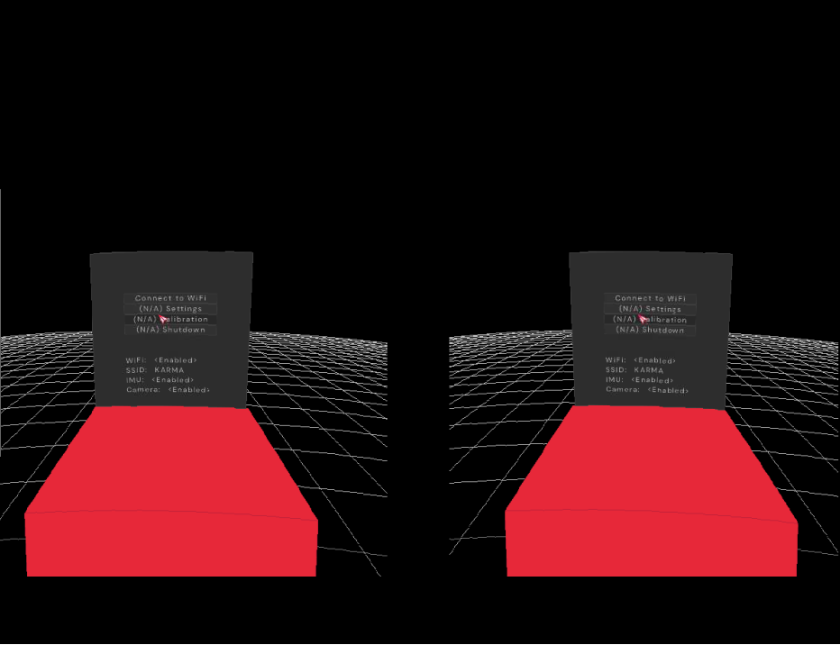

<center><h1 align=center>OpenWiXR-Renderer</h1></center>

**Wisor-Renderer** is the standalone rendering engine of Wisor, built using raylib, designed to provide basic rendering, UI, and input capabilities for your standalone XR applications. It works in conjunction with Wisor-Core.



## Getting Started

This project uses multiple ``Makefile``s for managing the build process. 
Before building the Wisor-Renderer project, ensure that your `make` flags meet the requirements of your Raspberry Pi. Read and follow [raylib's wiki](https://github.com/raysan5/raylib/wiki/Working-on-Raspberry-Pi), and install required packages in case there are compilation errors.

The version of the OpenGL is crucial to make everything run as expected. For the stereo rendering to work, OpenGL version should be either:
* OpenGL 2.1 on X11 desktop mode (`PLATFORM_DESKTOP`), 
* OpenGL ES 2.0 in **native mode** (no X11 required) (``PLATFORM_DRM`` or ``PLATFORM_RPI``)

## Building the Project

Tested and recommended with X11:
```bash
make all PLATFORM=PLATFORM_DESKTOP GRAPHICS=GRAPHICS_API_OPENGL_21
```

`GRAPHICS` flag only affects the raylib building process.

You can also use the following commands to build and clean the project:

- `make all`: Build both raylib and Wisor-Renderer.
- `make raylib`: Build raylib.
- `make wisor`: Build Wisor-Renderer.
- `make clean`: Clean build artifacts.

If you want to rebuild/clean a specific module, use the `rebuild` target along with the `module` parameter. Here are some examples:

```bash
make rebuild module=raylib/src PLATFORM=PLATFORM_DESKTOP
make rebuild module=wisor PLATFORM=PLATFORM_DESKTOP
make clean module=raylib/src
make clean module=wisor
```
